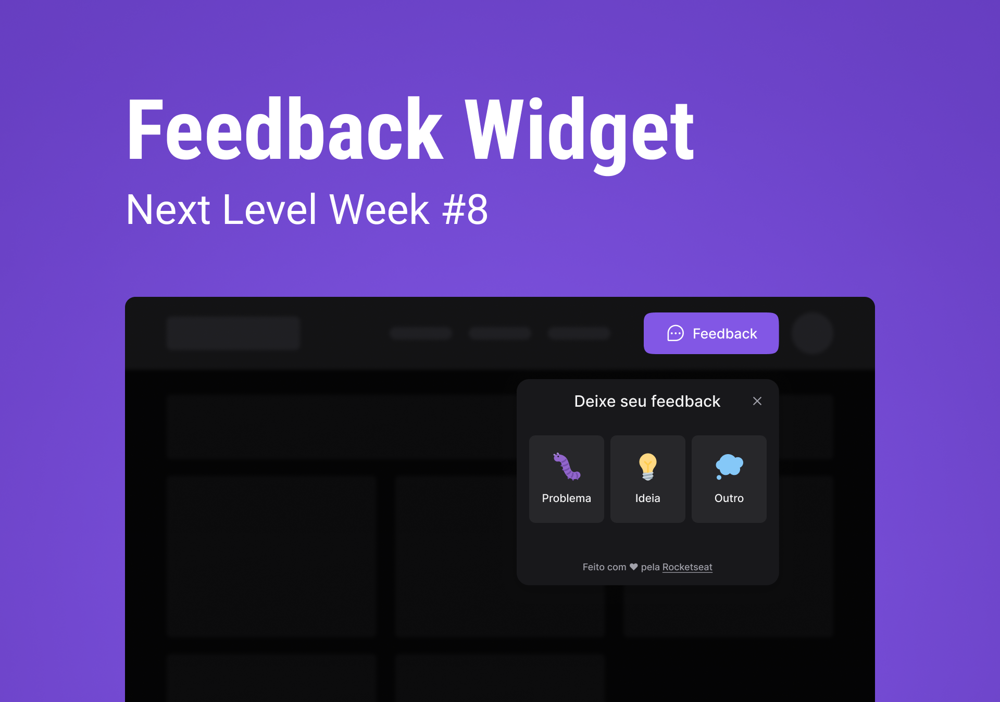

<h1 align="center">FeedGet</h1>

  

    </img>

 

## 💻 Projeto

O <b>FeedGet</b> e um projeto multiplataforma que disponibiliza meios de comunicação aos usuários de suas aplicações, foi desenvolvido durante a semana da [NLW-RETURN](https://github.com/rocketseat-education) com base neste [protótipo](https://www.figma.com/file/hXALNdrGIlqclxcVvZL2OJ/Feedget?node-id=113%3A1918).

## ✨ Tecnologias

Esse projeto foi desenvolvido com as seguintes tecnologias:

> Api
- [NodeJS](https://nodejs.org/en/)
- [TypeScript](https://www.typescriptlang.org/)
- [Express](https://expressjs.com/)
- [Prisma](https://www.prisma.io/)
- [Nodemailer](https://nodemailer.com/about/)
- [Jest](https://jestjs.io/)
- [Cors](https://github.com/expressjs/cors)
>Web
- [NodeJS](https://nodejs.org/en/)
- [TypeScript](https://www.typescriptlang.org/)
- [React](https://reactjs.org/)
- [Axios](https://axios-http.com/)
- [Tailwind ](https://tailwindcss.com/)
- [HTML](https://developer.mozilla.org/pt-BR/docs/Web/HTML)
>Mobile
- [NodeJS](https://nodejs.org/en/)
- [TypeScript](https://www.typescriptlang.org/)
- [React Native](https://reactnative.dev/)
- [Expo](https://expo.dev/)
- [Axios](https://axios-http.com/)

## 🚀 Como executar

- Clone o repositório
>Api
- Rode `cd API` para ir até a pasta da api
- Rode `npm install` para instalar as dependências
- Rode o `npm run dev` para iniciar a aplicação na porta <b>3333</b>
- Por fim, a <b>API</b> estará disponível em `http://localhost:3333`
>Web
- Rode `cd WEB` para ir até a pasta web
- Rode `npm install` para instalar as dependências
- Rode o `npm run dev` para iniciar a aplicação na porta <b>3000</b>
- Por fim, o <b>Website</b> estará disponível em `http://localhost:3000`
>Mobile
#### ***Obs: tenha o expo [instalado](https://docs.expo.dev/) na sua maquina**
- Rode `cd MOBILE` para ir até a pasta mobile
- Rode `expo install` para instalar as dependências
- Rode o `expo start` para iniciar a aplicação
- Por fim, o <b>Bundler do APP</b> estará disponível

## 📄 Licença

Esse projeto está sob a licença MIT. Veja o arquivo [LICENSE](LICENSE) para mais detalhes.
